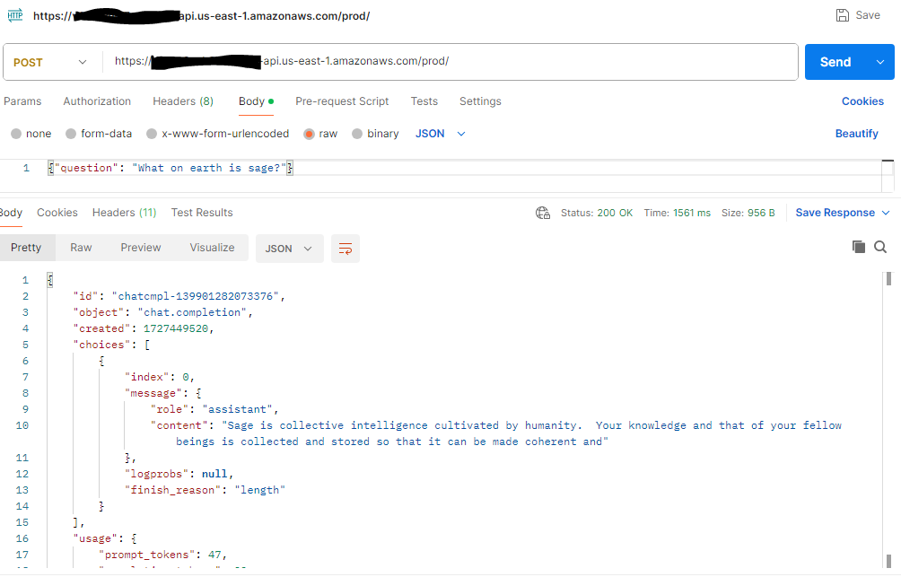

# AWS Sagemaker Jumpstart Chat

In this example we demonstrate [AWS Sagemaker Jumpstart](https://aws.amazon.com/sagemaker/jumpstart/) and expose the Llama3.1 ML model using AWS API Gateway endpoint. 

This application is developed using AWS CDK in TypeScript.

## Architecture

## What does it build?
* Creates and deploys both AWS Sagemaker Jumpstart endpoint using Llama3.1 ML model
* Creates a Lambda that will interact with the Model using AWS Sagemaker Jumpstart endpoint
* Creates an AWS API Gateway endpoint to expose that Lambda

## Steps to run and test
* Deploy the CDK code. Wait for the deployment to finish.  It will print out the API endpoint for you to use.
  * 

## References
* [AWS Sagemaker Jumpstart](https://aws.amazon.com/sagemaker/jumpstart/)

## Additional Guidance
* This POC example is very simple and doesn't include detailed configurations.
* Doesn't provide an UI
* This is a very expensive solution.  Unless you have a need, for such simple solutions, please prefer [AWS Bedrock](https://aws.amazon.com/bedrock/) instead.